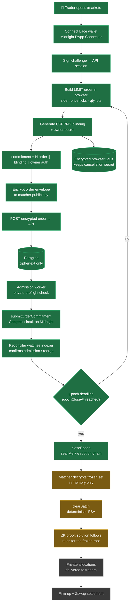
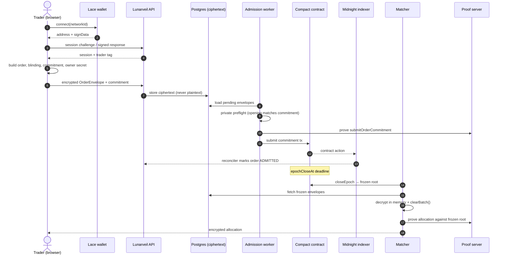
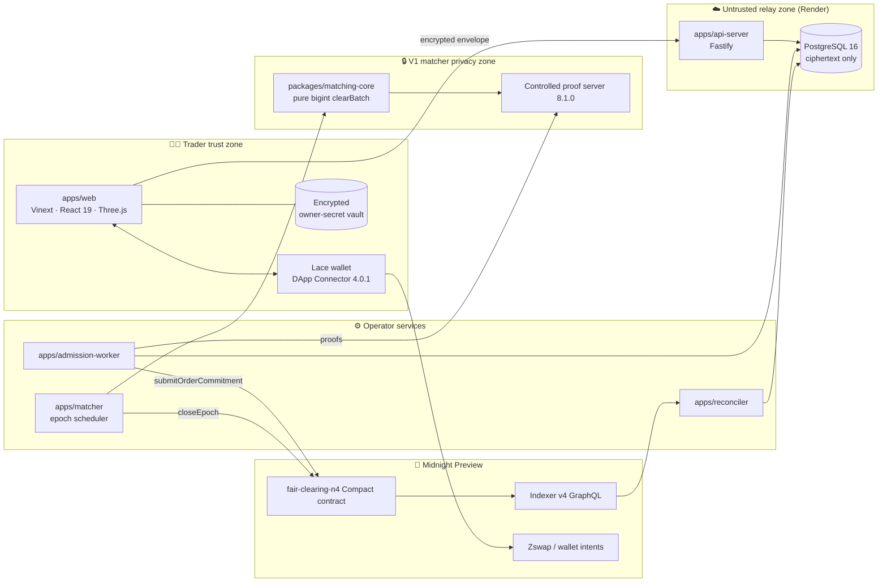
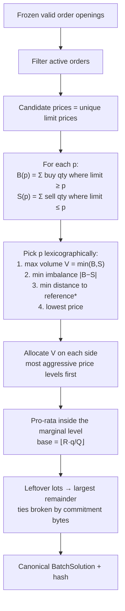
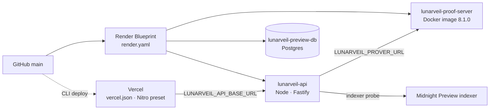

# 🌙 Lunarveil

**Private batch exchange on Midnight: fair batch clearing that anyone can check, without showing your order book to the chain.**

Built for the **AKINDO × Midnight Buildathon 2026**.

| | |
| --- | --- |
| 🌐 Web app | Vercel: `lunarveil-review` (landing + `/markets`) |
| 🔌 API | [`lunarveil-api.onrender.com/v1/system/status`](https://lunarveil-api.onrender.com/v1/system/status) |
| 🧮 Proof server | `lunarveil-proof-server.onrender.com` (pinned `midnightntwrk/proof-server:8.1.0`) |
| ⛓️ Network | Midnight **Preview** testnet |

> ⚠️ **Development preview. Do not use real funds.** The full order-to-settlement flow is not finished yet. See [What works today](#-what-works-today) for exactly what has been verified.

---

## Table of contents

1. [The problem](#-the-problem)
2. [Our solution](#-our-solution)
3. [How it works](#-how-it-works)
4. [Architecture](#-architecture)
5. [The Compact contract](#-the-compact-contract)
6. [Deterministic matching](#-deterministic-matching)
7. [Privacy and trust model](#-privacy--trust-model)
8. [Tech stack](#-tech-stack)
9. [What works today](#-what-works-today)
10. [Repository layout](#-repository-layout)
11. [Running locally](#-running-locally)
12. [Deployment](#-deployment)
13. [Roadmap](#-roadmap)

---

## 🧩 The problem

Traders on-chain have two options today, and neither is good:

| | Public DEX (AMM / order book) | Off-chain dark pool |
| --- | --- | --- |
| Order privacy | ❌ Price, size and strategy are public before execution | ✅ Hidden |
| Front-running / MEV | ❌ Searchers can see intent and sandwich it | ✅ Harder |
| Fair execution | ✅ Rules can be checked on-chain | ❌ **You have to trust the operator** |
| Who went first | ❌ Gas auctions and latency races decide | ❌ Up to the operator |

- **Transparency leaks alpha.** A public limit order tells everyone your price and size. Large traders get front-run, and every retail order is exposed to MEV.
- **Privacy costs trust.** Dark pools hide orders, but the operator can reorder, skip or favour flow. Nobody can check the matching.
- **Continuous matching rewards speed.** First-come-first-served turns trading into a latency race instead of competition on price.

**We want both: orders stay private, and anyone can check that execution was fair.**

## 💡 Our solution

Lunarveil is a **frequent batch auction (FBA)** exchange built on Midnight's zero-knowledge smart contracts:

1. **Pre-trade privacy.** Order side, limit price and size never reach the public ledger. The chain only stores a **commitment** (a hash of the order plus a random blinding value).
2. **Frozen order set.** At a public deadline the epoch **closes** and the Merkle root of every admitted commitment is sealed on-chain. Orders cannot be added, removed or reordered after that point.
3. **Deterministic clearing.** A pure function computes one uniform clearing price and pro-rata allocations. There is no clock, no randomness and no operator discretion.
4. **ZK verification.** A Compact circuit checks that the proposed solution follows the published rules for exactly the frozen order set. A wrong or malicious solution fails verification.
5. **Private settlement.** Matched traders settle through Midnight wallet / Zswap intents, with no custom custody contract.
6. **Owner-only cancellation.** Orders are cancelled with a secret held only by the owner. A nullifier stops replays.

---

## 🔄 How it works

### End-to-end order lifecycle



<sub>🟩 implemented and tested · 🟨 implemented as services/circuits, orchestration in progress · ⬜ planned</sub>

### Sequence view



---

## 🏗️ Architecture



### Trust boundaries

```text
TRADER TRUST ZONE        private intent, blinding, owner secret, wallet keys
        │  ciphertext + public commitment only
        ▼
UNTRUSTED RELAY ZONE     API, Postgres. Stores ciphertext, never plaintext orders
        │
        ▼
V1 MATCHER PRIVACY ZONE  decrypts only in memory → deterministic clearBatch()
        │  private witness
        ▼
CONTROLLED PROVER ZONE   witness → proof (never sent to an untrusted public prover)
        │
        ▼
PUBLIC MIDNIGHT ZONE     commitments, roots, nullifiers, epoch config, proofs
```

---

## 📜 The Compact contract

`spikes/midnight-smoke/contracts/fair-clearing-n4-m3b.compact` holds a bounded **4-order** fair-clearing market.

**Public ledger (what the chain sees):**

| State | Purpose |
| --- | --- |
| `orderCommitments` (historic Merkle tree) | Hiding commitments to admitted orders |
| `marketId`, `ruleVersionHash`, `configHash` | Pins the market and the exact matching rules |
| `epochCloseAt` | Deadline fixed at deployment. No circuit can shorten or extend it |
| `epochClosed`, `closedRoot`, `closedStartIndex/EndIndexExclusive` | The frozen order set |
| `consumedOrderNullifiers` | Cancelled or consumed orders (replay protection) |
| `fairSolutionSubmitted`, `fairSolutionCommitment` | Commitment to the checked batch solution |

**Circuits:**

| Circuit | What it enforces |
| --- | --- |
| `submitOrderCommitment` | Admits a commitment before `epochCloseAt`, with an idempotent request key |
| `closeEpoch` | Only allowed at or after the deadline. Seals the Merkle root and index range |
| `cancelOrder` | Proves knowledge of the owner secret and publishes a nullifier |
| `validateSlot` / `scorePrice` / `chooseBestScore` | Re-derives the clearing price inside the circuit |
| `verifyAllocation` / `baseAtLevel` / `remainderRankPart` | Checks price-time-free pro-rata allocation and remainder ranking |

The circuit is bounded to **N = 4**, LIMIT / GFE orders with partial fills. The wider matching-core feature set (FOK, minFill, reference-price tie-break) is tested off-chain and is not yet a circuit claim.

---

## ⚖️ Deterministic matching

`packages/matching-core` is a **pure function**. It uses no database, clock, network, randomness or floating point. It is the executable reference that the circuit mirrors.



Arrival time is **never** used, so there is no latency race. Property-based and adversarial tests cover conservation, limit-price respect, and deterministic output.

---

## 🔐 Privacy & trust model

| Data | Public chain | API / DB | Matcher (V1) | Trader |
| --- | :-: | :-: | :-: | :-: |
| Order commitment | ✅ | ✅ | ✅ | ✅ |
| Side / price / size | ❌ | ❌ ciphertext | ✅ in memory | ✅ |
| Blinding / owner secret | ❌ | ❌ | ❌ owner secret | ✅ |
| Wallet identity ↔ order | ❌ (pseudonymous trader tag) | tag only | tag only | ✅ |
| Clearing rules and frozen root | ✅ | ✅ | ✅ | ✅ |

**V1 trust statement:** Lunarveil V1 hides orders from the public chain and ordinary observers. It does **not** hide them from the single matcher, which decrypts orders in memory to compute the batch. The matcher **cannot change the rules or the frozen set** without failing verification. A threshold/MPC matcher on the roadmap removes this remaining confidentiality trust.

---

## 🛠️ Tech stack

| Layer | Technology |
| --- | --- |
| Smart contracts | **Compact** (toolchain `0.31.1`), compact-runtime `0.16.0`, onchain-runtime `3.0.0` |
| Midnight SDK | Midnight.js `4.1.1`, wallet-sdk `1.2.0`, DApp Connector API `4.0.1`, Indexer v4, proof server `8.1.0` |
| Frontend | React 19, **Vinext** (Next-style app router on Vite 8), Nitro, Three.js / React Three Fiber (moon scene) |
| Wallet | Lace (Midnight) via DApp Connector, Bech32m ↔ raw identity normalization (`@scure/base`) |
| Backend | Node.js 22, TypeScript 5.9, Fastify API, long-running worker processes |
| Data | PostgreSQL 16 + Prisma migrations, ciphertext-only envelope storage, advisory-lock worker exclusivity |
| Crypto | Commitments via the Compact runtime (WASM in browser), envelope encryption, wallet signature auth |
| Testing | Vitest, property/adversarial matcher tests, real-ledger auth tests, WSL disposable-Postgres integration tests |
| Hosting | **Vercel** (web), **Render** (API, proof server, Postgres) |

---

## ✅ What works today

**Verified on Midnight Preview:**

- **M2 two-wallet checkpoint:** contract [`4fdd5989…4d4e17`](https://preview.midnightexplorer.com/contracts/0x4fdd598916fb9a1acb3f3cab2e57e3ee0d10e08cba8dac2825c94d39645d4e17). The run covered deploy, admissions from two wallets, epoch close, and an owner cancellation. Post-close admission and cancellation replay were **rejected on-chain as expected**.
- **M3 N=4 fair-clearing contract** deployed and reconciled: `5f5b5b99…327d91` (block 730027, `SucceedEntirely`).

**Implemented and tested:**

- Wallet connection (Lace), challenge-signature sessions, pseudonymous trader tags
- Real encrypted order submission from the browser, plus an order lifecycle view per trader
- Owner-bound cancellation secrets kept in an encrypted browser vault
- Admission worker with private preflight: the opening must match the commitment before it goes on-chain
- Indexer reconciler with reorg re-check and alerting
- Epoch scheduler driving OPEN → CLOSED
- Deterministic matching core, and M3b deadline-protected contract (compiled and checked, **not yet deployed**)
- Live dependency readiness at `/v1/system/status`

**Local proof benchmarks** (proof server 8.1.0, single sample):

| Circuit | Warm proof | Proof size |
| --- | ---: | ---: |
| `submitOrderCommitment` | 1,726 ms | 4,508 B |
| `closeEpoch` | 140 ms | 2,940 B |
| `cancelOrder` | 6,367 ms | 4,508 B |

**Not finished yet:** full close → proof → allocation → firm-up → settlement orchestration, production KMS, and atomic coupling of settlement to the exchange contract. The hosted API currently reports `PROVER: DEGRADED` and `KMS: UNAVAILABLE`.

---

## 📁 Repository layout

| Directory | Responsibility |
| --- | --- |
| `apps/web` | Moon landing experience and markets UI |
| `apps/api-server` | API process, wallet sessions and encrypted order intake |
| `apps/admission-worker` | Durable admission-submission worker with private preflight |
| `apps/reconciler` | Indexer observations and admission reconciliation |
| `apps/matcher` | Epoch-close scheduler |
| `packages/matching-core` | Pure bigint batch matching plus property/adversarial tests |
| `packages/crypto` | Commitments and encrypted order/allocation envelopes |
| `packages/db` | PostgreSQL repositories, Prisma schema and migrations |
| `packages/matcher` | Lifecycle services and in-memory batch preparation |
| `packages/api`, `packages/api-client` | HTTP boundary and typed browser client |
| `packages/chain`, `packages/midnight`, `packages/wallet-auth` | Chain, wallet connector and auth adapters |
| `packages/settlement` | Typed pairwise intent settlement adapter |
| `spikes/midnight-smoke` | Compact contracts, compiler/proof checks and chain checkpoints |
| `schemas`, `openapi`, `config` | Wire contracts and pinned Midnight compatibility matrix |

---

## 🚀 Running locally

Requires **Node.js 22+** and npm.

```sh
npm ci
npm run typecheck
npm test
npm --workspace @lunarveil/web run dev     # http://localhost:3000
```

The landing page needs no database or wallet. To use `/markets` against the hosted API, copy `apps/web/.env.example` and set:

```sh
LUNARVEIL_API_BASE_URL=https://lunarveil-api.onrender.com
LUNARVEIL_CHAIN_NETWORK=preview
```

### API and database

Use a dedicated PostgreSQL 16 database and inject variables from your shell or a secret manager. `.env.example` lists the names.

```sh
export DATABASE_URL=...            # Prisma
export LUNARVEIL_DATABASE_URL=...  # application (same DB)
export LUNARVEIL_TRADER_TAG_KEY=... # ≥32 random bytes, hex
npm exec -- prisma migrate deploy --schema packages/db/prisma/schema.prisma
npm --workspace @lunarveil/api-server run start
```

### Compact contracts and proofs

Midnight tooling uses its own lockfile and the pinned versions in `config/midnight-compatibility.yaml`. On Windows, Compact compiles through Ubuntu 24.04 WSL.

```sh
npm --prefix spikes/midnight-smoke ci
npm run midnight:m2        # compile + verify M2 contract
npm run midnight:m3        # compile + check M3b fairness / epoch-close
npm run midnight:proof-server:install
npm run midnight:proof-server:start   # separate terminal
npm run midnight:m3-proofs
```

Chain commands need explicit network configuration and funded **test-only** wallet seeds supplied at runtime. Never commit seeds, and never send private witnesses to an untrusted prover.

---

## ☁️ Deployment



- **Vercel:** `vercel.json` builds the web app with Vinext's Nitro Vercel preset from the repository root. Set `LUNARVEIL_API_BASE_URL` to the Render API.
- **Render:** `render.yaml` declares the API, the pinned proof server and a Node web preview. Secrets (`DATABASE_URL`, `LUNARVEIL_TRADER_TAG_KEY`, `LUNARVEIL_ALLOWED_ORIGINS`) are marked manual on purpose.

These are **development previews** with development-only key handling. They are not a production exchange.

---

## 🗺️ Roadmap

- [x] M0: Midnight hello-world on a local chain
- [x] M2: Commitment admission, epoch close and cancellation on Preview
- [x] M3a: N=4 fair-clearing contract deployed on Preview
- [x] Browser wallet sessions, encrypted order intake, admission worker, reconciler
- [x] M3b: deadline-protected epoch close (compiled and checked)
- [ ] Deploy M3b and wire the full close → prove → allocate flow
- [ ] Firm-up + Zswap atomic settlement end-to-end
- [ ] Audit-bundle export (inclusion proof + rules + settlement)
- [ ] Scale to 16/32 orders per batch
- [ ] Production KMS for matcher keys
- [ ] Threshold / MPC matcher, so no single party sees orders

---

## Repository hygiene

This public snapshot leaves out planning documents, agent files, wallet stores, local network state, compiled contract output, build caches and original GLB source duplicates. Optimized models used by the frontend are included. Tests, migrations and lockfiles are kept for reproducibility.
